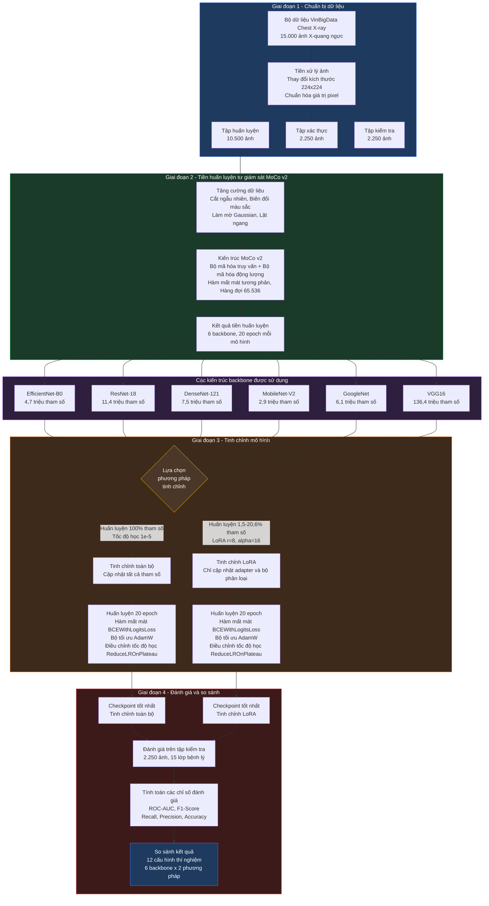

# 📊 Báo Cáo Tổng Hợp Kết Quả Huấn Luyện - Khóa Luận Tốt Nghiệp

> **Đề tài:** Chẩn đoán bệnh lý X-quang ngực sử dụng MoCo v2 + LoRA trên bộ dữ liệu VinBigData
> **Pipeline:** MoCo v2 Pretrain → Fine-tuning (Full / LoRA) → Đánh giá trên Test Set
> **Ngày tổng hợp:** 24/04/2026

---

## Sơ Đồ Tổng Quan Pipeline Huấn Luyện



---

## Sơ Đồ Chi Tiết Quy Trình Huấn Luyện

```mermaid
flowchart TD
    START(["Bắt đầu"]) --> SEED["Khởi tạo hạt giống ngẫu nhiên\nseed = 42"]
    SEED --> DATA["Nạp dữ liệu\nDataLoader huấn luyện, xác thực, kiểm tra\nKích thước batch = 32"]
    DATA --> MODEL["Khởi tạo mô hình\nBackbone không tải trọng số ImageNet\nBộ phân loại tùy chỉnh\n512 đơn vị ẩn, 15 đầu ra"]
    MODEL --> PRETRAIN["Nạp trọng số tiền huấn luyện\nMoCo v2 Pretrain, epoch 20"]

    PRETRAIN --> MODE{"Lựa chọn\nphương pháp\ntinh chỉnh"}
    MODE -->|"Tinh chỉnh toàn bộ"| FULL_SETUP["Mở khóa toàn bộ tham số\nBộ tối ưu AdamW\nTốc độ học = 1e-5\nSuy giảm trọng số = 5e-4"]
    MODE -->|"Tinh chỉnh LoRA"| LORA_SETUP["Đóng băng backbone\nGắn bộ điều hợp LoRA\nr=8, alpha=16, dropout=0,3\nMở khóa bộ phân loại\nTốc độ học = 1e-4\nSuy giảm trọng số = 1e-4"]

    FULL_SETUP --> SETUP
    LORA_SETUP --> SETUP

    SETUP["Thiết lập các thành phần huấn luyện\nBộ điều chỉnh tốc độ học: ReduceLROnPlateau\nHỗn hợp độ chính xác: GradScaler FP16\nHàm mất mát: BCEWithLogitsLoss"]

    SETUP --> RESUME{"Tiếp tục từ\ncheckpoint\ntrước đó?"}
    RESUME -->|"Có"| LOAD_CKPT["Khôi phục trạng thái huấn luyện\nTrọng số mô hình\nTrạng thái bộ tối ưu\nTrạng thái bộ điều chỉnh tốc độ học\nTrạng thái GradScaler\nEpoch bắt đầu và AUC tốt nhất"]
    RESUME -->|"Không"| INIT["Khởi tạo mới\nEpoch bắt đầu = 0\nAUC tốt nhất = 0,0"]

    LOAD_CKPT --> LOOP
    INIT --> LOOP

    LOOP["Vòng lặp huấn luyện\nLặp từ epoch bắt đầu đến epoch 20"]

    LOOP --> TRAIN["Pha huấn luyện\nChế độ huấn luyện\nDuyệt toàn bộ batch dữ liệu\nLan truyền xuôi với AMP FP16\nTính hàm mất mát\nLan truyền ngược và cập nhật trọng số"]

    TRAIN --> VAL["Pha xác thực\nChế độ đánh giá, không tính gradient\nLan truyền xuôi trên tập xác thực\nTính mất mát xác thực\nThu thập xác suất dự đoán"]

    VAL --> AUC["Tính toán chỉ số đánh giá\nROC-AUC trung bình 15 lớp bệnh\nĐộ chính xác với ngưỡng 0,5"]

    AUC --> SCHED["Cập nhật tốc độ học\nReduceLROnPlateau theo giá trị AUC\nGiảm tốc độ học nhân 0,1\nnếu AUC không cải thiện sau 2 epoch"]

    SCHED --> LOG["Ghi nhận kết quả\nTensorBoard\nFile CSV chế độ nối thêm\nFile JSON"]

    LOG --> CHECK{"AUC hiện tại\ncao hơn\nAUC tốt nhất?"}
    CHECK -->|"Đúng"| SAVE_BEST["Lưu checkpoint tốt nhất\nCập nhật giá trị AUC tốt nhất"]
    CHECK -->|"Không"| NEXT

    SAVE_BEST --> NEXT{"Còn epoch\ntiếp theo?"}
    NEXT -->|"Còn"| LOOP
    NEXT -->|"Đã hoàn thành\n20 epoch"| FINAL["Lưu checkpoint cuối cùng"]

    FINAL --> DONE(["Kết thúc huấn luyện"])

    style START fill:#16a34a,stroke:#15803d,color:#fff
    style DONE fill:#16a34a,stroke:#15803d,color:#fff
    style MODE fill:#4a3728,stroke:#f59e0b,color:#fff
    style RESUME fill:#4a3728,stroke:#f59e0b,color:#fff
    style CHECK fill:#4a3728,stroke:#f59e0b,color:#fff
    style NEXT fill:#4a3728,stroke:#f59e0b,color:#fff
    style LOOP fill:#1e3a5f,stroke:#3b82f6,color:#fff
    style TRAIN fill:#1a3a2a,stroke:#22c55e,color:#fff
    style VAL fill:#3d1a1a,stroke:#ef4444,color:#fff
    style SAVE_BEST fill:#2d1f3d,stroke:#a855f7,color:#fff
    style FINAL fill:#2d1f3d,stroke:#a855f7,color:#fff
```



---

## 1. Cấu Hình Thí Nghiệm Chung

| Thông số | Giá trị |
|---|---|
| **Bộ dữ liệu** | VinBigData Chest X-ray |
| **Số lớp bệnh** | 15 (14 bệnh lý + No finding) |
| **Kích thước ảnh** | 224 × 224 |
| **Train / Val / Test** | 10,500 / 2,250 / 2,250 |
| **Batch size** | 32 |
| **Số epoch (Pretrain)** | 20 |
| **Số epoch (Fine-tune)** | 20 |
| **Loss function** | BCEWithLogitsLoss (với pos_weight) |
| **Seed** | 42 |

### Cấu hình Fine-tuning

| Phương pháp | Learning Rate | Weight Decay |
|---|---|---|
| **Full Fine-tuning** | 1e-5 | 5e-4 |
| **LoRA Fine-tuning** | 1e-4 | 1e-4 |

### Cấu hình LoRA

| Thông số | Giá trị |
|---|---|
| Rank | 8 |
| Alpha | 16 |
| Dropout | 0.3 |

---

## 2. Thông Số Mô Hình (Parameters)

| Backbone | Total Params (Full) | Trainable (Full) | Total Params (LoRA) | Trainable (LoRA) | % Trainable LoRA |
|---|---:|---:|---:|---:|---:|
| **EfficientNet-B0** | 4,671,115 | 4,671,115 (100%) | 5,535,706 | 864,591 | **15.6%** |
| **ResNet-18** | 11,446,863 | 11,446,863 (100%) | 11,944,542 | 497,679 | **4.2%** |
| **DenseNet-121** | 7,486,351 | 7,486,351 (100%) | 8,654,750 | 1,168,399 | **13.5%** |
| **MobileNet-V2** | 2,887,439 | 2,887,439 (100%) | 3,638,814 | 751,375 | **20.6%** |
| **GoogleNet** | 6,132,399 | 6,132,399 (100%) | 6,933,566 | 801,167 | **11.6%** |
| **VGG16** | 136,365,903 | 136,365,903 (100%) | 138,512,222 | 2,146,319 | **1.5%** |

> [!NOTE]
> LoRA chỉ fine-tune một phần nhỏ tham số (1.5% – 20.6%) so với Full Fine-tuning (100%), giúp tiết kiệm đáng kể tài nguyên.

---

## 3. Kết Quả MoCo v2 Pretrain (20 Epochs)

| Backbone | Loss (Epoch 1) | Loss (Epoch 20) | Giảm Loss | Tổng thời gian (phút) |
|---|---:|---:|---:|---:|
| **EfficientNet-B0** | 6.632 | 3.074 | **53.6%** | ~101 |
| **ResNet-18** | 1.179 | 0.718 | **39.1%** | ~31 |
| **DenseNet-121** | 6.415 | 1.608 | **74.9%** | ~97 |
| **MobileNet-V2** | 6.803 | 3.413 | **49.8%** | ~97 |
| **GoogleNet** | 6.940 | 3.977 | **42.7%** | ~96 |
| **VGG16** | 7.074 | 4.141 | **41.5%** | ~507 |

---

## 4. Kết Quả Fine-tuning (Validation Set)

### 4.1 MoCo + Full Fine-tuning

| Backbone | Best Val AUC | Best Epoch | Final Train Loss | Final Val Loss | Final Accuracy | Thời gian/Epoch |
|---|---:|---:|---:|---:|---:|---:|
| **EfficientNet-B0** | **0.9263** | 19 | 0.1228 | 0.1383 | 72.6% | ~109s |
| **ResNet-18** | 0.9228 | 18 | 0.1133 | 0.1355 | 71.6% | ~103s |
| **DenseNet-121** | 0.9267 | 19 | 0.1034 | 0.1379 | 71.6% | ~770s |
| **MobileNet-V2** | 0.9139 | 20 | 0.1391 | 0.1452 | 71.7% | ~102s |
| **GoogleNet** | 0.9201 | 20 | 0.1229 | 0.1392 | 71.3% | ~100s |
| **VGG16** | **0.9353** | 19 | 0.0888 | 0.1419 | 72.7% | ~3,221s |

### 4.2 MoCo + LoRA Fine-tuning

| Backbone | Best Val AUC | Best Epoch | Final Train Loss | Final Val Loss | Final Accuracy | Thời gian/Epoch |
|---|---:|---:|---:|---:|---:|---:|
| **EfficientNet-B0** | 0.9260 | 19 | 0.1272 | 0.1395 | 72.3% | ~106s |
| **ResNet-18** | 0.9251 | 19 | 0.1267 | 0.1371 | 71.8% | ~118s |
| **DenseNet-121** | **0.9312** | 20 | 0.1133 | 0.1338 | 70.8% | ~158s |
| **MobileNet-V2** | 0.9212 | 19 | 0.1307 | 0.1400 | 71.7% | ~97s |
| **GoogleNet** | 0.9234 | 19 | 0.1243 | 0.1370 | 71.6% | ~136s |
| **VGG16** | 0.9021 | 20 | 0.1394 | 0.1565 | 70.1% | ~223s |

---

## 5. So Sánh Best Val AUC: Full Fine-tuning vs LoRA

| Backbone | Full FT (AUC) | LoRA (AUC) | Δ AUC | LoRA tốt hơn? |
|---|---:|---:|---:|:---:|
| **EfficientNet-B0** | 0.9263 | 0.9260 | -0.0003 | ≈ Tương đương |
| **ResNet-18** | 0.9228 | 0.9251 | +0.0023 | ✅ |
| **DenseNet-121** | 0.9267 | **0.9312** | +0.0045 | ✅ |
| **MobileNet-V2** | 0.9139 | 0.9212 | +0.0073 | ✅ |
| **GoogleNet** | 0.9201 | 0.9234 | +0.0033 | ✅ |
| **VGG16** | **0.9353** | 0.9021 | -0.0332 | ❌ |

> [!IMPORTANT]
> **Nhận xét:** LoRA cho kết quả **tương đương hoặc tốt hơn** Full Fine-tuning trên 5/6 backbone, ngoại trừ VGG16 (vì chỉ 1 lớp conv được áp dụng LoRA → features.28). VGG16 Full FT bị overfitting rõ rệt nhưng vẫn đạt AUC cao nhất tổng thể.

---

## 6. Kết Quả Đánh Giá Trên Tập Test

### 6.1 Tổng hợp chỉ số trung bình (Macro Average)

| Backbone | Phương pháp | ROC-AUC | Accuracy | F1-Score | Recall | Precision |
|---|---|---:|---:|---:|---:|---:|
| **EfficientNet-B0** | Full FT | 0.9320 | 0.9506 | 0.3686 | 0.3176 | 0.5492 |
| **EfficientNet-B0** | **LoRA** | **0.9320** | **0.9506** | **0.3686** | **0.3176** | **0.5492** |
| **ResNet-18** | Full FT | 0.9281 | 0.9497 | 0.3544 | 0.3025 | 0.5384 |
| **ResNet-18** | LoRA | 0.9262 | 0.9501 | 0.3443 | 0.2989 | 0.4881 |
| **DenseNet-121** | Full FT | 0.9337 | 0.9502 | 0.3731 | 0.3250 | 0.5348 |
| **DenseNet-121** | **LoRA** | **0.9373** | **0.9499** | **0.3863** | **0.3407** | **0.5547** |
| **MobileNet-V2** | Full FT | 0.9153 | 0.9472 | 0.3172 | 0.2683 | 0.5117 |
| **MobileNet-V2** | LoRA | 0.9219 | 0.9496 | 0.3536 | 0.3154 | 0.5352 |
| **GoogleNet** | Full FT | 0.9235 | 0.9488 | 0.3460 | 0.2981 | 0.5024 |
| **GoogleNet** | LoRA | 0.9282 | 0.9492 | 0.3367 | 0.3022 | 0.4024 |
| **VGG16** | Full FT | **0.9384** | **0.9522** | **0.3974** | **0.3555** | **0.5637** |
| **VGG16** | LoRA | 0.9011 | 0.9422 | 0.2791 | 0.2374 | 0.4289 |

### 🏆 Xếp hạng theo Test ROC-AUC

| Hạng | Mô hình | Test AUC |
|:---:|---|---:|
| 🥇 1 | VGG16 + Full FT | **0.9384** |
| 🥈 2 | DenseNet-121 + LoRA | **0.9373** |
| 🥉 3 | DenseNet-121 + Full FT | 0.9337 |
| 4 | EfficientNet-B0 + Full FT | 0.9320 |
| 4 | EfficientNet-B0 + LoRA | 0.9320 |
| 6 | GoogleNet + LoRA | 0.9282 |
| 7 | ResNet-18 + Full FT | 0.9281 |
| 8 | ResNet-18 + LoRA | 0.9262 |
| 9 | GoogleNet + Full FT | 0.9235 |
| 10 | MobileNet-V2 + LoRA | 0.9219 |
| 11 | MobileNet-V2 + Full FT | 0.9153 |
| 12 | VGG16 + LoRA | 0.9011 |

---

## 7. Kết Quả Per-Class AUC (Tập Test) — Top 3 Models

| Bệnh lý | DenseNet LoRA | VGG16 Full | EfficientNet LoRA |
|---|---:|---:|---:|
| Aortic enlargement | 0.9762 | 0.9726 | 0.9737 |
| Atelectasis | 0.9057 | 0.8890 | 0.9030 |
| Calcification | 0.8825 | 0.8706 | 0.8756 |
| Cardiomegaly | **0.9803** | 0.9771 | 0.9772 |
| Consolidation | 0.9440 | 0.9373 | 0.9345 |
| ILD | **0.9493** | 0.9420 | 0.9412 |
| Infiltration | 0.9260 | 0.9207 | 0.9212 |
| Lung Opacity | 0.9247 | 0.9178 | 0.9174 |
| Nodule/Mass | 0.8921 | 0.8909 | 0.8805 |
| Other lesion | **0.9094** | 0.8992 | 0.8917 |
| Pleural effusion | 0.9476 | 0.9398 | 0.9393 |
| Pleural thickening | 0.9275 | 0.9249 | 0.9251 |
| Pneumothorax | 0.9510 | **0.9533** | 0.9393 |
| Pulmonary fibrosis | 0.9243 | 0.9250 | 0.9228 |
| No finding | **0.9887** | 0.9812 | 0.9814 |
| **Trung bình** | **0.9373** | 0.9384 | 0.9320 |

> [!TIP]
> Các bệnh hiếm (Atelectasis: 143, Pneumothorax: 65 mẫu train) vẫn đạt AUC > 0.89, cho thấy MoCo pretrain giúp mô hình học tốt ngay cả với ít dữ liệu nhãn.

---

## 8. Phân Tích Overfitting

| Backbone | Phương pháp | Train Loss (E20) | Val Loss (E20) | Gap | Nhận xét |
|---|---|---:|---:|---:|---|
| EfficientNet-B0 | Full FT | 0.1228 | 0.1383 | 0.0155 | Ổn định |
| EfficientNet-B0 | LoRA | 0.1272 | 0.1395 | 0.0123 | Ổn định |
| ResNet-18 | Full FT | 0.1132 | 0.1367 | 0.0236 | Nhẹ |
| ResNet-18 | LoRA | 0.1267 | 0.1371 | 0.0105 | **Rất ổn định** |
| DenseNet-121 | Full FT | 0.1034 | 0.1372 | 0.0338 | Nhẹ |
| DenseNet-121 | LoRA | 0.1133 | 0.1338 | 0.0205 | Ổn định |
| MobileNet-V2 | Full FT | 0.1391 | 0.1452 | 0.0061 | **Rất ổn định** |
| MobileNet-V2 | LoRA | 0.1297 | 0.1394 | 0.0097 | **Rất ổn định** |
| GoogleNet | Full FT | 0.1229 | 0.1392 | 0.0163 | Ổn định |
| GoogleNet | LoRA | 0.1251 | 0.1366 | 0.0115 | Ổn định |
| VGG16 | Full FT | 0.0419 | 0.2492 | **0.2073** | ⚠️ **Overfitting nặng** |
| VGG16 | LoRA | 0.1394 | 0.1565 | 0.0171 | Ổn định |

> [!WARNING]
> **VGG16 Full Fine-tuning** bị overfitting nghiêm trọng (gap = 0.207) do 136M params được train với chỉ 10,500 mẫu. Tuy nhiên AUC vẫn cao nhờ backbone mạnh. LoRA giúp giảm overfitting đáng kể trên VGG16 (gap chỉ 0.017).

---

## 9. So Sánh Thời Gian Huấn Luyện

| Backbone | Full FT (phút/epoch) | LoRA (phút/epoch) | Tỷ lệ tiết kiệm |
|---|---:|---:|---:|
| **EfficientNet-B0** | ~1.8 | ~1.7 | 6% |
| **ResNet-18** | ~1.7 | ~2.0 | -15% (*) |
| **DenseNet-121** | ~12.8 | ~2.6 | **80%** |
| **MobileNet-V2** | ~1.7 | ~1.6 | 6% |
| **GoogleNet** | ~1.7 | ~2.3 | -33% (*) |
| **VGG16** | ~53.7 | ~3.7 | **93%** |

> (*) LoRA chậm hơn trên ResNet/GoogleNet do overhead tính toán adapter, nhưng mô hình nhỏ nên chênh lệch không đáng kể.

> [!TIP]
> LoRA tiết kiệm thời gian **đặc biệt hiệu quả** trên các mô hình lớn: VGG16 giảm 93%, DenseNet giảm 80%.

---

## 10. Kết Luận Tổng Quan

### ✅ Kết quả chính:

1. **MoCo v2 + LoRA** đạt hiệu suất **tương đương hoặc vượt trội** so với Full Fine-tuning trên 5/6 backbone, chỉ fine-tune **1.5% – 20.6%** tổng tham số.

2. **DenseNet-121 + LoRA** là mô hình tối ưu nhất khi cân bằng giữa **hiệu suất (AUC = 0.9373)**, **khả năng tổng quát hóa (gap thấp)**, và **hiệu quả tài nguyên**.

3. **VGG16 + Full FT** đạt AUC cao nhất (0.9384) nhưng **overfitting nặng** và tiêu tốn tài nguyên gấp ~14 lần.

4. Tất cả 12 cấu hình đều đạt **ROC-AUC > 0.90**, chứng tỏ hiệu quả của MoCo v2 pretrain trên domain y tế.

5. Các bệnh hiếm (Pneumothorax, Atelectasis) có **F1-Score thấp** (0.0 ở nhiều mô hình) do class imbalance nghiêm trọng, nhưng **AUC vẫn cao** (> 0.86).

### 📌 Đề xuất cho triển khai:

| Tiêu chí | Mô hình đề xuất |
|---|---|
| **Hiệu suất tốt nhất** | VGG16 + Full FT (AUC 0.9384) |
| **Cân bằng tốt nhất** | DenseNet-121 + LoRA (AUC 0.9373) |
| **Nhẹ nhất (Edge/Mobile)** | EfficientNet-B0 + LoRA (AUC 0.9320, 864K params) |
| **Chống overfitting tốt nhất** | MobileNet-V2 + LoRA (gap = 0.0097) |

---

## 11. Biểu Đồ Minh Họa

### 📊 Nhóm A — So Sánh Tổng Quan

#### A1: Test ROC-AUC — Full FT vs LoRA


---

#### A2: Test F1-Score — Full FT vs LoRA


---

#### A3: Số Tham Số Trainable — Full FT vs LoRA


---

### 📊 Nhóm B — Phân Tích Quá Trình Huấn Luyện

#### B1: Train Loss vs Val Loss theo Epoch


> [!WARNING]
> VGG16 Full FT (subplot phải dưới) cho thấy khoảng cách Train Loss và Val Loss ngày càng lớn — dấu hiệu overfitting rõ ràng.

---

#### B2: Val AUC theo Epoch


---

#### B3: MoCo v2 Pretrain Loss


---

### 📊 Nhóm C — Phân Tích Per-Class

#### C1: Heatmap Per-Class AUC — Tất Cả 12 Mô Hình


> [!TIP]
> Màu càng đậm = AUC càng cao. Cột VGG-LoRA nhạt nhất, DenseNet-LoRA đậm nhất tổng thể.

---

#### C2: Per-Class F1-Score — Top 3 Mô Hình


> [!IMPORTANT]
> Các bệnh Atelectasis, Calcification, Pneumothorax, Nodule/Mass có F1 ≈ 0 ở hầu hết mô hình do số mẫu dương quá ít trong tập train (65–313 mẫu).

---

### 📊 Nhóm D — Phân Tích Hiệu Quả

#### D1: Trainable Params vs Test AUC


> [!TIP]
> Các điểm LoRA (hình tròn cam) nằm bên trái nhưng AUC tương đương Full FT (hình vuông xanh) → LoRA hiệu quả hơn về tham số. DenseNet-LoRA nằm ở vùng tối ưu nhất.

---

#### D2: Overfitting Gap tại Epoch Cuối


> [!WARNING]
> VGG16 Full FT có gap = **0.2073** — gấp 10-20 lần so với các mô hình khác, cho thấy overfitting nghiêm trọng do 136M tham số với chỉ 10,500 mẫu.

---

## 12. Hướng Dẫn Vẽ Biểu Đồ

### 📋 Yêu cầu

```
pip install matplotlib numpy
```

### 🚀 Cách chạy

**Bước 1:** Sao chép file [generate_charts.py](file:///C:/Users/Asus/.gemini/antigravity/brain/c1dc7287-78e2-41c8-832e-317f2d42ef7a/scratch/generate_charts.py) vào thư mục `charts/` của dự án.

**Bước 2:** Sửa 2 biến đường dẫn ở đầu file:

```python
PROJECT = r"d:\Khoa_Luan\03_Code\App_Demo_Bao_Cao_KLTN"  # thư mục gốc dự án
OUT = r"d:\Khoa_Luan\03_Code\App_Demo_Bao_Cao_KLTN\charts\output"  # thư mục lưu ảnh
```

**Bước 3:** Chạy script:

```bash
python charts/generate_charts.py
```

Script sẽ tự động đọc dữ liệu từ `logs_moco/` và `results_eval/`, tạo 10 file PNG.

### 📂 Cấu trúc file dữ liệu cần có

```
App_Demo_Bao_Cao_KLTN/
├── logs_moco/
│   ├── pretrain_{Backbone}/metrics_pretrain.csv          ← B3
│   ├── full_finetune_{Backbone}/metrics_full_{Backbone}.json   ← B1, B2, D2
│   ├── full_finetune_{Backbone}/run_info_full_{Backbone}.json  ← A3, D1
│   ├── lora_finetune_{Backbone}/metrics_lora_{Backbone}.json   ← B1, B2, D2
│   └── lora_finetune_{Backbone}/run_info_lora_{Backbone}.json  ← A3, D1
├── results_eval/
│   ├── moco_full_{backbone}_result.csv                   ← A1, A2, C1, C2
│   └── moco_lora_{backbone}_result.csv                   ← A1, A2, C1, C2
```

> `{Backbone}` = EfficientNet, ResNet, DenseNet, MobileNet, GoogleNet, VGG16

### 📝 Source Code

<details>
<summary>Nhấn để mở toàn bộ code generate_charts.py (~500 dòng)</summary>

```python
"""
Script tạo tất cả biểu đồ cho báo cáo Khóa Luận.
Dữ liệu lấy từ logs_moco/ và results_eval/
"""
import json, csv, os
import numpy as np
import matplotlib
matplotlib.use('Agg')
import matplotlib.pyplot as plt
import matplotlib.ticker as ticker

# ======== CẤU HÌNH ĐƯỜNG DẪN ========
PROJECT = r"d:\Khoa_Luan\03_Code\App_Demo_Bao_Cao_KLTN"
LOGS = os.path.join(PROJECT, "logs_moco")
EVAL = os.path.join(PROJECT, "results_eval")
OUT = os.path.join(PROJECT, "charts", "output")  # Thư mục lưu ảnh
os.makedirs(OUT, exist_ok=True)

BACKBONES = ["EfficientNet", "ResNet", "DenseNet", "MobileNet", "GoogleNet", "VGG16"]
LABELS = ["EfficientNet-B0", "ResNet-18", "DenseNet-121", "MobileNet-V2", "GoogleNet", "VGG16"]
C_FULL = "#2563eb"  # Xanh dương
C_LORA = "#f97316"  # Cam

plt.rcParams.update({
    'font.size': 11, 'axes.titlesize': 13, 'axes.labelsize': 12,
    'figure.dpi': 150, 'savefig.bbox': 'tight', 'savefig.pad_inches': 0.15,
})

# ======== HÀM ĐỌC DỮ LIỆU ========
def load_metrics_json(backbone, mode):
    folder = f"{'full' if mode=='full' else 'lora'}_finetune_{backbone}"
    path = os.path.join(LOGS, folder, f"metrics_{mode}_{backbone}.json")
    with open(path, "r", encoding="utf-8") as f:
        return json.load(f)

def load_run_info(backbone, mode):
    folder = f"{'full' if mode=='full' else 'lora'}_finetune_{backbone}"
    path = os.path.join(LOGS, folder, f"run_info_{mode}_{backbone}.json")
    with open(path, "r", encoding="utf-8") as f:
        return json.load(f)

def load_pretrain_csv(backbone):
    path = os.path.join(LOGS, f"pretrain_{backbone}", "metrics_pretrain.csv")
    with open(path, "r", encoding="utf-8") as f:
        return list(csv.DictReader(f))

def load_eval_csv(backbone, mode):
    path = os.path.join(EVAL, f"moco_{mode}_{backbone.lower()}_result.csv")
    with open(path, "r", encoding="utf-8") as f:
        return list(csv.DictReader(f))

def short_name(lbl):
    for prefix in ["Eff","Res","Den","Mob","Goo","VGG"]:
        if prefix in lbl: return prefix
    return lbl[:3]

CLASS_NAMES = [
    "Aortic enlargement", "Atelectasis", "Calcification", "Cardiomegaly",
    "Consolidation", "ILD", "Infiltration", "Lung Opacity",
    "Nodule/Mass", "Other lesion", "Pleural effusion", "Pleural thickening",
    "Pneumothorax", "Pulmonary fibrosis", "No finding"
]

# ======== A1: Grouped Bar — Test ROC-AUC ========
def chart_a1():
    full_auc, lora_auc = [], []
    for bb in BACKBONES:
        full_auc.append(float(load_eval_csv(bb, "full")[-1]["AUC"]))
        lora_auc.append(float(load_eval_csv(bb, "lora")[-1]["AUC"]))
    x = np.arange(len(LABELS)); w = 0.35
    fig, ax = plt.subplots(figsize=(12, 6))
    b1 = ax.bar(x-w/2, full_auc, w, label="Full Fine-tuning", color=C_FULL, edgecolor="white", zorder=3)
    b2 = ax.bar(x+w/2, lora_auc, w, label="LoRA Fine-tuning", color=C_LORA, edgecolor="white", zorder=3)
    ax.set_ylabel("Test ROC-AUC"); ax.set_title("So Sánh Test ROC-AUC: Full Fine-tuning vs LoRA")
    ax.set_xticks(x); ax.set_xticklabels(LABELS); ax.set_ylim(0.89, 0.945)
    ax.legend(loc="lower right"); ax.grid(axis="y", alpha=0.3, zorder=0)
    for bars, c in [(b1,C_FULL),(b2,C_LORA)]:
        for bar in bars:
            ax.text(bar.get_x()+bar.get_width()/2, bar.get_height()+0.001,
                    f"{bar.get_height():.4f}", ha='center', va='bottom', fontsize=8, color=c, fontweight='bold')
    fig.savefig(os.path.join(OUT, "chart_a1_test_auc.png")); plt.close(fig)

# ======== A2: Grouped Bar — Test F1-Score ========
def chart_a2():
    full_f1, lora_f1 = [], []
    for bb in BACKBONES:
        full_f1.append(float(load_eval_csv(bb, "full")[-1]["F1-Score"]))
        lora_f1.append(float(load_eval_csv(bb, "lora")[-1]["F1-Score"]))
    x = np.arange(len(LABELS)); w = 0.35
    fig, ax = plt.subplots(figsize=(12, 6))
    b1 = ax.bar(x-w/2, full_f1, w, label="Full Fine-tuning", color=C_FULL, edgecolor="white", zorder=3)
    b2 = ax.bar(x+w/2, lora_f1, w, label="LoRA Fine-tuning", color=C_LORA, edgecolor="white", zorder=3)
    ax.set_ylabel("Test F1-Score (Macro)"); ax.set_title("So Sánh Test F1-Score: Full Fine-tuning vs LoRA")
    ax.set_xticks(x); ax.set_xticklabels(LABELS); ax.set_ylim(0.20, 0.45)
    ax.legend(loc="upper right"); ax.grid(axis="y", alpha=0.3, zorder=0)
    for bars, c in [(b1,C_FULL),(b2,C_LORA)]:
        for bar in bars:
            ax.text(bar.get_x()+bar.get_width()/2, bar.get_height()+0.003,
                    f"{bar.get_height():.3f}", ha='center', va='bottom', fontsize=8, color=c, fontweight='bold')
    fig.savefig(os.path.join(OUT, "chart_a2_test_f1.png")); plt.close(fig)

# ======== A3: Bar — Trainable Params ========
def chart_a3():
    full_p, lora_p = [], []
    for bb in BACKBONES:
        full_p.append(load_run_info(bb, "full")["trainable_params"])
        lora_p.append(load_run_info(bb, "lora")["trainable_params"])
    x = np.arange(len(LABELS)); w = 0.35
    fig, ax = plt.subplots(figsize=(12, 6))
    ax.bar(x-w/2, [p/1e6 for p in full_p], w, label="Full Fine-tuning", color=C_FULL, edgecolor="white", zorder=3)
    ax.bar(x+w/2, [p/1e6 for p in lora_p], w, label="LoRA Fine-tuning", color=C_LORA, edgecolor="white", zorder=3)
    ax.set_ylabel("Trainable Parameters (triệu)"); ax.set_title("So Sánh Số Tham Số Huấn Luyện")
    ax.set_xticks(x); ax.set_xticklabels(LABELS); ax.legend()
    ax.grid(axis="y", alpha=0.3, zorder=0); ax.set_yscale('log')
    ax.yaxis.set_major_formatter(ticker.FuncFormatter(lambda v,_: f"{v:.1f}M" if v>=1 else f"{v:.2f}M"))
    for i in range(len(LABELS)):
        ratio = lora_p[i] / full_p[i] * 100
        ax.text(x[i], max(full_p[i],lora_p[i])/1e6*1.3, f"LoRA: {ratio:.1f}%",
                ha='center', fontsize=8, fontstyle='italic', color='#666')
    fig.savefig(os.path.join(OUT, "chart_a3_params.png")); plt.close(fig)

# ======== B1: Line — Train Loss vs Val Loss (4 subplot) ========
def chart_b1():
    selected = ["EfficientNet", "DenseNet", "MobileNet", "VGG16"]
    sel_labels = ["EfficientNet-B0", "DenseNet-121", "MobileNet-V2", "VGG16"]
    fig, axes = plt.subplots(2, 2, figsize=(14, 10))
    fig.suptitle("Train Loss vs Val Loss theo Epoch", fontsize=15, fontweight='bold')
    for idx, (bb, lbl) in enumerate(zip(selected, sel_labels)):
        ax = axes[idx//2][idx%2]
        for mode, ls, color, tag in [("full","-",C_FULL,"Full FT"),("lora","--",C_LORA,"LoRA")]:
            m = load_metrics_json(bb, mode)
            ax.plot([e["epoch"] for e in m], [e["train_loss"] for e in m], ls, color=color, alpha=0.7,
                    label=f"Train ({tag})", linewidth=1.5)
            ax.plot([e["epoch"] for e in m], [e["val_loss"] for e in m], ls, color=color, alpha=1.0,
                    label=f"Val ({tag})", linewidth=2.0, marker='o', markersize=3)
        ax.set_title(lbl, fontweight='bold'); ax.set_xlabel("Epoch"); ax.set_ylabel("Loss")
        ax.legend(fontsize=8, loc='upper right'); ax.grid(alpha=0.3)
    plt.tight_layout()
    fig.savefig(os.path.join(OUT, "chart_b1_loss_curves.png")); plt.close(fig)

# ======== B2: Line — Val AUC theo Epoch (6 subplot) ========
def chart_b2():
    fig, axes = plt.subplots(2, 3, figsize=(18, 10))
    fig.suptitle("Val AUC theo Epoch — Full Fine-tuning vs LoRA", fontsize=15, fontweight='bold')
    for idx, (bb, lbl) in enumerate(zip(BACKBONES, LABELS)):
        ax = axes[idx//3][idx%3]
        for mode, ls, color, tag in [("full","-",C_FULL,"Full FT"),("lora","--",C_LORA,"LoRA")]:
            m = load_metrics_json(bb, mode)
            ax.plot([e["epoch"] for e in m], [e["val_auc"] for e in m], ls, color=color,
                    label=tag, linewidth=2, marker='o', markersize=3)
        ax.set_title(lbl, fontweight='bold'); ax.set_xlabel("Epoch"); ax.set_ylabel("Val AUC")
        ax.legend(fontsize=9); ax.grid(alpha=0.3); ax.set_ylim(0.82, 0.94)
    plt.tight_layout()
    fig.savefig(os.path.join(OUT, "chart_b2_val_auc.png")); plt.close(fig)

# ======== B3: Line — Pretrain Loss ========
def chart_b3():
    fig, ax = plt.subplots(figsize=(10, 6))
    colors = ['#2563eb','#dc2626','#16a34a','#9333ea','#ea580c','#0891b2']
    for bb, lbl, c in zip(BACKBONES, LABELS, colors):
        d = load_pretrain_csv(bb)
        ax.plot([int(r["epoch"]) for r in d], [float(r["loss"]) for r in d],
                '-o', color=c, label=lbl, linewidth=2, markersize=4)
    ax.set_title("MoCo v2 Pretrain — Contrastive Loss theo Epoch", fontweight='bold')
    ax.set_xlabel("Epoch"); ax.set_ylabel("Contrastive Loss"); ax.legend(); ax.grid(alpha=0.3)
    fig.savefig(os.path.join(OUT, "chart_b3_pretrain_loss.png")); plt.close(fig)

# ======== C1: Heatmap — Per-Class AUC ========
def chart_c1():
    model_keys, auc_matrix = [], []
    for bb, lbl in zip(BACKBONES, LABELS):
        for mode, tag in [("full","Full"),("lora","LoRA")]:
            ev = load_eval_csv(bb, mode)
            model_keys.append(f"{short_name(lbl)}-{tag}")
            row = []
            for cn in CLASS_NAMES:
                found = [r for r in ev if r["Class"]==cn]
                row.append(float(found[0]["AUC"]) if found else 0.0)
            auc_matrix.append(row)
    data = np.array(auc_matrix)
    fig, ax = plt.subplots(figsize=(18, 8))
    im = ax.imshow(data.T, cmap="YlOrRd", aspect="auto", vmin=0.85, vmax=0.99)
    ax.set_xticks(range(len(model_keys))); ax.set_xticklabels(model_keys, rotation=45, ha='right')
    ax.set_yticks(range(len(CLASS_NAMES))); ax.set_yticklabels(CLASS_NAMES)
    for i in range(len(model_keys)):
        for j in range(len(CLASS_NAMES)):
            ax.text(i, j, f"{data[i,j]:.3f}", ha="center", va="center", fontsize=7,
                    color="white" if data[i,j]>0.95 else "black")
    ax.set_title("Per-Class ROC-AUC — Tất Cả 12 Mô Hình", fontweight='bold', pad=15)
    fig.colorbar(im, ax=ax, shrink=0.8, label="AUC"); plt.tight_layout()
    fig.savefig(os.path.join(OUT, "chart_c1_heatmap_auc.png")); plt.close(fig)

# ======== C2: Per-Class F1 — Top 3 ========
def chart_c2():
    SHORT = ["Aortic","Atelect.","Calcif.","Cardio.","Consol.","ILD","Infiltr.",
             "Lung Op.","Nod/Mass","Other","Pl.effus.","Pl.thick.","Pneumo.","Pul.fib.","No find."]
    top3 = [("DenseNet","lora","DenseNet-121 LoRA","#16a34a"),
            ("VGG16","full","VGG16 Full FT","#2563eb"),
            ("EfficientNet","lora","EfficientNet-B0 LoRA","#f97316")]
    x = np.arange(len(CLASS_NAMES)); w = 0.25
    fig, ax = plt.subplots(figsize=(16, 7))
    for i, (bb, mode, label, color) in enumerate(top3):
        ev = load_eval_csv(bb, mode)
        f1 = [float([r for r in ev if r["Class"]==cn][0]["F1-Score"]) if [r for r in ev if r["Class"]==cn] else 0
              for cn in CLASS_NAMES]
        ax.bar(x+(i-1)*w, f1, w, label=label, color=color, edgecolor="white", zorder=3)
    ax.set_ylabel("F1-Score"); ax.set_title("Per-Class F1-Score — Top 3 Mô Hình", fontweight='bold')
    ax.set_xticks(x); ax.set_xticklabels(SHORT, rotation=40, ha='right')
    ax.legend(); ax.grid(axis="y", alpha=0.3, zorder=0)
    ax.axhline(y=0.5, color='red', linestyle=':', alpha=0.4)
    plt.tight_layout()
    fig.savefig(os.path.join(OUT, "chart_c2_perclass_f1.png")); plt.close(fig)

# ======== D1: Scatter — Params vs AUC ========
def chart_d1():
    fig, ax = plt.subplots(figsize=(10, 7))
    for bb, lbl in zip(BACKBONES, LABELS):
        for mode, marker, color, tag in [("full","s",C_FULL,"Full"),("lora","o",C_LORA,"LoRA")]:
            ri = load_run_info(bb, mode); ev = load_eval_csv(bb, mode)
            p = ri["trainable_params"]; a = float(ev[-1]["AUC"])
            ax.scatter(p/1e6, a, s=120, marker=marker, color=color, edgecolors='black', linewidths=0.5, zorder=5)
            ax.annotate(f"{short_name(lbl)}-{tag}", (p/1e6,a), textcoords="offset points", xytext=(8,5), fontsize=8)
    ax.scatter([],[],s=80,marker='s',color=C_FULL,label="Full FT")
    ax.scatter([],[],s=80,marker='o',color=C_LORA,label="LoRA")
    ax.legend(fontsize=10); ax.set_xlabel("Trainable Parameters (triệu)"); ax.set_ylabel("Test ROC-AUC")
    ax.set_title("Hiệu Quả Tham Số: Trainable Params vs Test AUC", fontweight='bold')
    ax.set_xscale('log'); ax.grid(alpha=0.3)
    ax.xaxis.set_major_formatter(ticker.FuncFormatter(lambda v,_: f"{v:.1f}M"))
    plt.tight_layout()
    fig.savefig(os.path.join(OUT, "chart_d1_params_vs_auc.png")); plt.close(fig)

# ======== D2: Bar — Overfitting Gap ========
def chart_d2():
    gaps, mlabels, colors = [], [], []
    for bb, lbl in zip(BACKBONES, LABELS):
        for mode, tag, c in [("full","Full",C_FULL),("lora","LoRA",C_LORA)]:
            m = load_metrics_json(bb, mode)
            gaps.append(abs(m[-1]["train_loss"]-m[-1]["val_loss"]))
            mlabels.append(f"{short_name(lbl)}\n{tag}"); colors.append(c)
    fig, ax = plt.subplots(figsize=(14, 6))
    x = np.arange(len(gaps))
    bars = ax.bar(x, gaps, color=colors, edgecolor="white", zorder=3)
    vgg_idx = mlabels.index("VGG\nFull")
    bars[vgg_idx].set_edgecolor('red'); bars[vgg_idx].set_linewidth(2)
    for i, bar in enumerate(bars):
        ax.text(bar.get_x()+bar.get_width()/2, bar.get_height()+0.002, f"{gaps[i]:.4f}",
                ha='center', va='bottom', fontsize=7, fontweight='bold', color='red' if i==vgg_idx else '#333')
    ax.set_ylabel("Overfitting Gap"); ax.set_title("Mức Độ Overfitting tại Epoch Cuối", fontweight='bold')
    ax.set_xticks(x); ax.set_xticklabels(mlabels, fontsize=9)
    ax.axhline(y=0.03, color='red', linestyle=':', alpha=0.5)
    ax.grid(axis="y", alpha=0.3, zorder=0); plt.tight_layout()
    fig.savefig(os.path.join(OUT, "chart_d2_overfitting_gap.png")); plt.close(fig)

# ======== MAIN ========
if __name__ == "__main__":
    print("=== Generating all charts ===")
    for fn in [chart_a1, chart_a2, chart_a3, chart_b1, chart_b2, chart_b3,
               chart_c1, chart_c2, chart_d1, chart_d2]:
        fn(); print(f"  ✅ {fn.__name__}")
    print("=== All 10 charts generated! ===")
```

</details>

### 📊 Danh sách file output

| File | Biểu đồ | Kích thước |
|---|---|---|
| `chart_a1_test_auc.png` | Grouped Bar — Test ROC-AUC | 12×6 |
| `chart_a2_test_f1.png` | Grouped Bar — Test F1-Score | 12×6 |
| `chart_a3_params.png` | Bar — Trainable Params (log scale) | 12×6 |
| `chart_b1_loss_curves.png` | Line — Train/Val Loss (4 subplot) | 14×10 |
| `chart_b2_val_auc.png` | Line — Val AUC (6 subplot) | 18×10 |
| `chart_b3_pretrain_loss.png` | Line — Pretrain Loss | 10×6 |
| `chart_c1_heatmap_auc.png` | Heatmap — Per-Class AUC (12×15) | 18×8 |
| `chart_c2_perclass_f1.png` | Grouped Bar — Per-Class F1 Top 3 | 16×7 |
| `chart_d1_params_vs_auc.png` | Scatter — Params vs AUC | 10×7 |
| `chart_d2_overfitting_gap.png` | Bar — Overfitting Gap | 14×6 |
